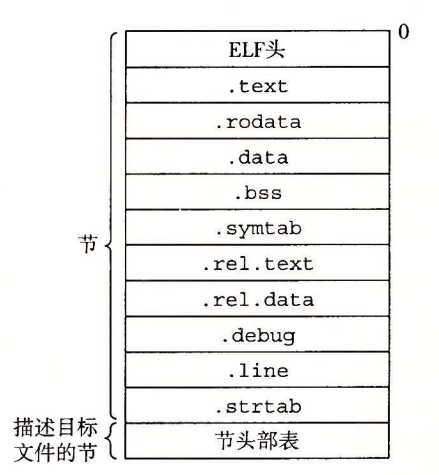

# 链接
链接（linking）是将各种代码和数据片段收集并组合成为一个单一文件的过程，可以在加载、编译、运行时执行。

- 编译时，即在源代码被翻译成机器代码时
- 加载时，即程序被加载器加载到内存并执行时
- 运行时，即由应用程序来执行

## 静态链接
链接器必须完成两个主要任务：  

* **符号解析（symbol resolution）。**目标文件定义和引用符号，每个符号对应于一个函数、一个全局变量或一个**静态变量**（即 C 语言中任何以 static 属性声明的变量）。符号解析的目的是将每个符号引用正好和一个符号定义关联起来。

* **重定位（relocation）。**编译器和汇编器生成从地址 0 开始的代码和数据节。链接器通过把每个符号定义与一个内存位置关联起来，从而重定位这些节，然后修改所有对这些符号的引用，使得它们指向这个内存位置。链接器使用汇编器产生的**重定位条目**（relocation entry）的详细指令，不加甄别地执行这样的重定位。

## 目标文件
目标文件有三种形式：

* **可重定位目标文件**包含二进制代码和数据，其形式可以在编译时与其他可重定位目标文件合并起来，创建一个可执行目标文件。

* **可执行目标文件**包含二进制代码和数据，其形式可以被直接复制到内存并执行。

* **共享目标文件**一种特殊类型的可重定位目标文件，可以在加载或者运行时被动态地加载进内存并链接。

编译器和汇编器生成可重定位目标文件和共享目标文件，链接器生成可执行目标文件。
目标文件是按照特定的目标文件格式来组织的，各个系统的目标文件格式都不相同。Windows 使用 PE 格式，Linux 使用 ELF 格式。

## 可重定位目标文件

* ELF 头：特殊的节，包含文件的一些基本属性信息，用来解释目标文件和帮助链接器进行语法分析。
包含内容：生成该文件的系统的字的大小和字节顺序，ELF 头的大小，目标文件的类型，机器类型(如 x86-64)，节头部表的文件偏移，节头部表中条目的大小和数量。

* **.text**已编译程序的机器代码。

* **.rodata**只读数据，比如 printf 语句中的格式串和开关语句的跳转表。

* **.data**已初始化的全局和静态 C 变量。局部 C 变量在运行时被保存在栈中，既不岀现在 .data 节中，也不岀现在 .bss 节中。

* **.bss**未初始化的全局和静态 C 变量，以及所有被初始化为 0 的全局或静态变量。在目标文件中这个节不占据实际的空间，它仅仅是一个占位符。目标文件格式区分已初始化和未初始化变量是为了空间效率：在目标文件中，未初始化变量不需要占据任何实际的磁盘空间。运行时，在内存中分配这些变量，初始值为 0。

* **.symtab**一个符号表，它存放在程序中定义和引用的函数和全局变量的信息。一些程序员错误地认为必须通过 -g 选项来编译一个程序，才能得到符号表信息。实际上，每个可重定位目标文件在 .symtab 中都有一张符号表（除非程序员特意用 STRIP 命令去掉它）。然而，和编译器中的符号表不同，.symtab 符号表不包含局部变量的条目。

* **.rel.text**一个 .text 节中位置的列表，当链接器把这个目标文件和其他文件组合时，需要修改这些位置。一般而言，任何调用外部函数或者引用全局变量的指令都需要修改。另一方面，调用本地函数的指令则不需要修改。注意，可执行目标文件中并不需要重定位信息，因此通常省略，除非用户显式地指示链接器包含这些信息。

* **.rel.data**被模块引用或定义的所有全局变量的重定位信息。一般而言，任何已初始化的全局变量，如果它的初始值是一个全局变量地址或者外部定义函数的地址，都需要被修改。

* **.debug**一个调试符号表，其条目是程序中定义的局部变量和类型定义，程序中定义和引用的全局变量，以及原始的 C 源文件。只有以 - g 选项调用编译器驱动程序时，才 会得到这张表。

* **.line**原始 C 源程序中的行号和 .text 节中机器指令之间的映射。只有以 -g 选项调用编译器驱动程序时，才会得到这张表。

* **.strtab**一个字符串表，其内容包括 .symtab 和 .debug 节中的符号表，以及节头部中的节名字。字符串表就是以 null 结尾的字符串的序列。

* 节头部表：特殊的节，是一个用来描述目标文件的节。
内容：含有与目标文件中每个节相对应的一个条目，描述了对应节的位置和大小等信息。

伪节

有三个特殊的伪节，它们在节头部表中是没有条目的：

1. ABS：代表不该被重定位的符号

2) UNDEF：代表未定义的符号，即在本目标模块中引用，但在其他地方定义的符号

3. COMMON：表示还未被分配位置的未初始化的数据目标。

这些伪节只有可重定位文件中才有，可执行文件中没有。

 

COMMON 和 .bss 的区别很细微：

1. COMMON：未初始化的全局变量

2) .bss：未初始化的静态变量，初始化为 0 的全局或静态变量

原因：未初始化的全局变量是全局符号中的弱符号，编译器将其分配为 COMMON 以表明是弱符号。

## 符号和符号表
**重定位的核心就是对符号表进行符号解析**

在链接器的上下文中，有三种不同的符号：

* 由模块 m 定义并能被其他模块引用的**全局符号**。全局链接器符号对应于非静态的 C 函数和全局变量。

* 由其他模块定义并被模块 m 引用的**全局符号**。这些符号称为外部符号，对应于在其他模块中定义的非静态 C 函数和全局变量。

* 只被模块 m 定义和引用的**局部符号**。它们对应于带 static 属性的 C 函数和全局变量。这些符号在模块 m 中任何位置都可见，但是不能被其他模块引用。

对照 C++ 的语法来理解什么是全局符号和局部符号（static 对全局变量和函数的隐藏效果是一样的）：

1. C++ 中，static 变量只能在本文件中使用，即使外其他文件中用 extern 中声明也不行。属于这里的局部符号

2) C++ 中，非 static 的全局变量在其他文件中也能使用，只需在该文件中用 extern 声明即可。属于这里的全局符号

```
typedef struct{
    int name;//name 是一个字符串表(.strtab节)中的字节偏移，指向符号的名字(用一个以 null 结尾的字符串表示)
    char type:4;//表明符号的类型：数据或函数（4 bits）
         binding:4;//表明符号是本地的还是全局的（4 bits）//这里的意思似乎是 type 和 binding 分别是一个 char 类型的高四位和低四位
    char reserved;//
    short section;//表明符号位于文件的哪个节中，section 是一个到节头部表的索引。
    long value;//对于可重定位文件而言，value 是距定义目标的节的起始位置的偏移；对于可执行文件而言，value 是一个绝对运行时地址
    long size;//对象的大小，以字节为单位
}
```
## 符号解析
